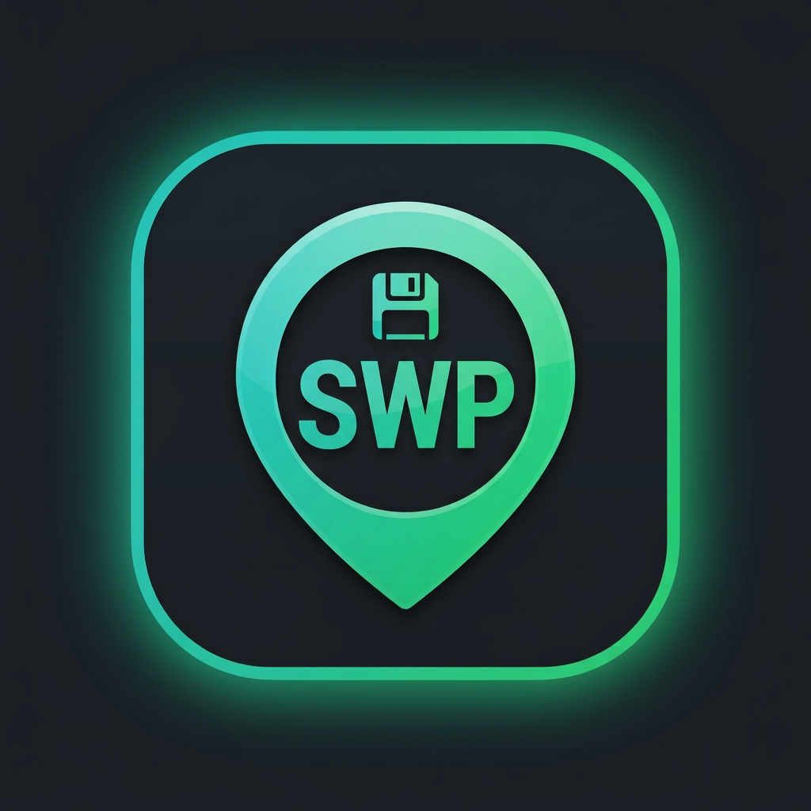

<p align="center">
  
</p>

<h1 align="center">SaveWaypoint</h1>

<p align="center"><i>Set a waypoint for your game saves.</i></p>

A [Decky Loader](https://github.com/SteamDeckHomebrew/decky-loader) plugin for the
Steam Deck / SteamOS handhelds that **auto-detects your non-Steam game saves**
(emulators, Proton games) and syncs them to **your own private GitHub repo** — so
you can pick up your progress on another device.

> ⚠️ **Status: early MVP, not yet tested on real hardware.** The code is complete
> and structured, but it needs validation on an actual Steam Deck before it can be
> called stable. Treat cloud data as non-authoritative until you've verified a full
> backup → restore cycle yourself.

## Why

Steam Cloud only covers Steam games. Emulator saves, GOG/itch games and other
non-Steam titles are on their own. SaveWaypoint finds those saves for you and
keeps them in a private git repo you control — **no server owned by us, no
subscription, git history gives you free version restore.**

### What makes it different from existing sync plugins

- **Auto-detection with a confidence status**, instead of typing paths by hand:
  - 🟢 **Detected** — a known emulator location with files present. Safe to sync.
  - 🟡 **Probable** — a save-looking folder found inside a Proton prefix. You
    confirm before it syncs.
  - 🔴 **Not detected** — expected but empty (e.g. the game hasn't saved yet).
- **Phone-based login** via GitHub's device flow — no keyboard or browser on the Deck.
- **"Test this save"** button: verifies a save is readable *and* its folder is
  writable (restorable) before you rely on it.
- **No third-party save database** → no licensing strings attached (see *Legal*).

## How storage works

Each selected game's save folder is archived to `saves/<id>/backup.tar.gz` in a
**private** repo on your account (default `savewaypoint-saves`). Every backup is a
git commit, so the commit history *is* your version history.

## One-time setup: GitHub OAuth Client ID

The phone login needs a GitHub **OAuth App** Client ID (free, 2 minutes):

1. Go to **GitHub → Settings → Developer settings → OAuth Apps → New OAuth App**.
2. Application name: `SaveWaypoint` (anything). Homepage URL: this repo URL.
   Authorization callback URL: `https://github.com/login/device` (unused by
   device flow, but the field is required).
3. **Enable Device Flow** (checkbox on the app page).
4. Copy the **Client ID** and paste it into the plugin's first screen.

> The Client ID is not a secret; it's safe to embed. Advanced users can instead
> paste a fine-grained Personal Access Token with `repo` scope (backend method
> `set_pat`).

## Build & install (developer)

```bash
# needs Node + pnpm
corepack enable
pnpm install
pnpm run build          # produces dist/index.js
```

Then copy the folder (with `dist/`, `main.py`, `py_modules/`, `plugin.json`) to
`~/homebrew/plugins/SaveWaypoint` on the Deck and restart Decky Loader, or use the
Decky developer "install from zip" flow.

## Layout

```
main.py              Decky backend (Plugin class, async methods)
py_modules/
  detector.py        save auto-detection (emulators + Proton scan)
  github_store.py    GitHub device-flow auth + Contents API storage
  swp_settings.py    local JSON settings
src/index.tsx        React frontend (Decky UI)
```

## Legal

- This plugin's code is **MIT**.
- It deliberately uses **no PCGamingWiki / Ludusavi manifest** data. Save paths
  here are public technical facts about each emulator, compiled independently, so
  there is no CC-BY-NC-SA ("non-commercial") data baggage.
- Your saves live in *your* GitHub repo under *your* account.

## Roadmap

- Auto-backup on game close.
- In-plugin version picker (restore an older commit).
- Optional Google Drive / OneDrive backends (same rclone-style abstraction).
- QR code rendering for the login code.
